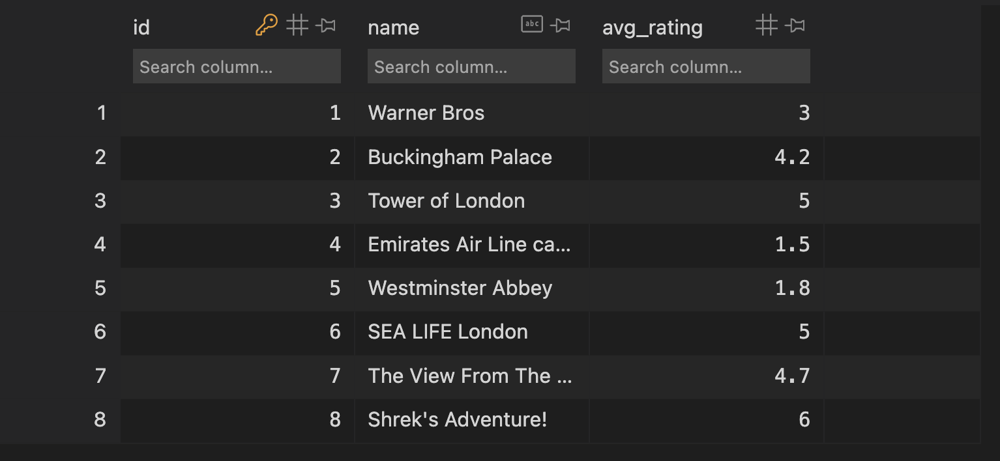
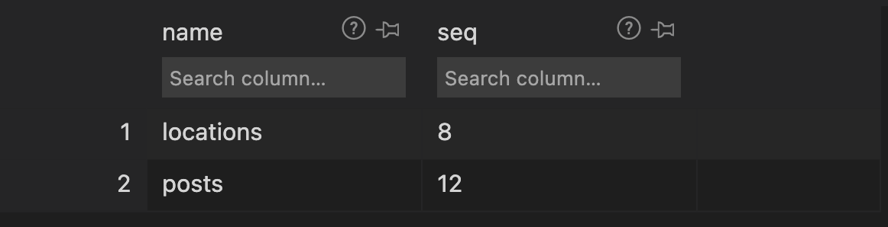
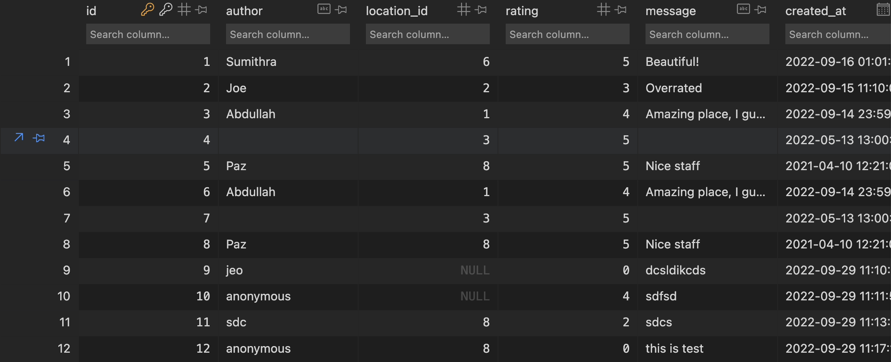
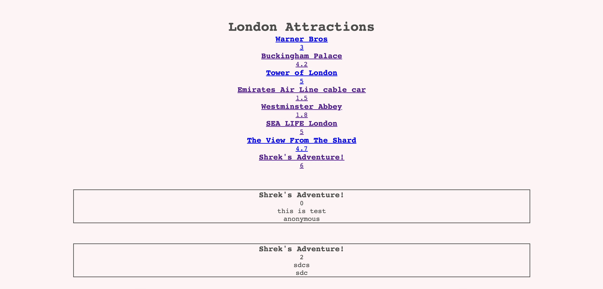

# Week 2 Database

## London Attractions Reviews

### By: Sumithra, Joe, Abdullah, Paz

Our London attractions reviews application allows the user to review the most popular attractions

You can find our site hosted on [Heroku](https://london-attractions.herokuapp.com/)

## Setup

Make sure you have Git and Node (v18) installed.

1. Clone this repo and `cd` into the directory
2. Run `npm install` to install all the dependencies
3. Run `npm run dev` to start the server.

This uses the `nodemon` library to auto-restart the server when you save changes.

## Users Stories

- [x] As a user, I want to: submit information to your site for anyone to see
- [x] As a user, I want to: come back to your site later and see what I posted is still there

## Acceptance Criteria

- [x] A form for users to submit data
- [x] A page showing all the data
- [x] Semantic form elements with correctly associated labels
- [x] A SQLite database
- [x] A schema describing your database in your README
- [ ] Tests for server routes and database access
- [x] Not process user input as SQL commands
- [x] Hidden environment variables (i.e. not on GitHub)

## Schema

Our database contain three tables.

1. Locations
2. sqlite seqence
3. posts

## Snapshot

